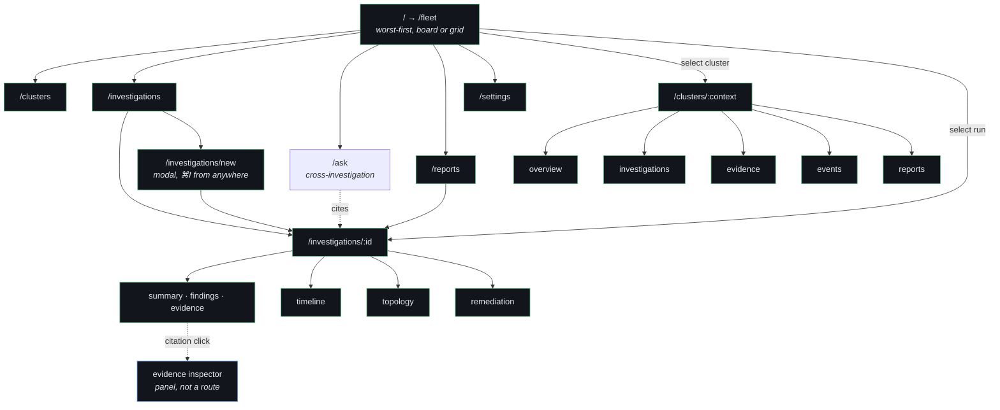
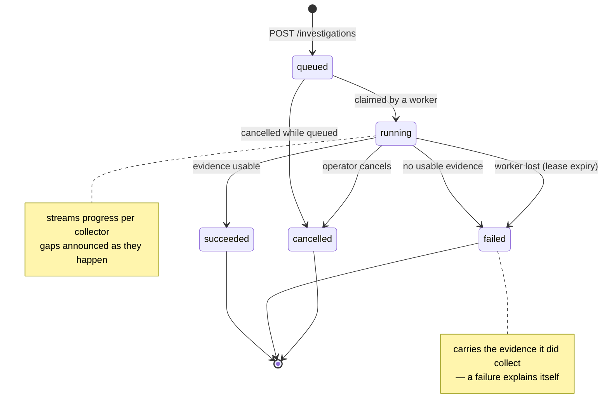

# Console Redesign

**Status:** Proposed · **Audience:** Design, frontend, product
**Scope:** The operator-facing console. The investigation engine is not redesigned.

---

## 0. The finding that shapes everything else

The brief asks for Fleet, Incidents, Knowledge Graph, Topology, Playbooks and
Alerts as primary navigation. **Six of those have no backing data**, and two of
them are scheduled milestones that have not been built.

Under the constraint **"do not rewrite the backend, reuse all existing APIs"**,
the question is not "what is on the roadmap" but "what can be *derived* from
responses that already exist". That is a sharper question, and the answer is
more generous than a first pass suggests.

| Requested surface | Derivable from existing APIs? | Route |
|---|---|---|
| Investigations, live progress, evidence, timeline, reports | **Yes, fully** | Ships now |
| **Fleet / cluster status** | **Yes** — `/investigation-jobs` returns `request.context` per job plus status and result. Group by context, take the newest per cluster. Durable since M3 | Ships now |
| **Topology (workload)** | **Yes** — `PodSpecCollector` stores `owner{kind,name,workload_kind,workload_name}`, `node`, `volumes`, `config_refs`. That is `Deployment → ReplicaSet → Pod → Node`, plus PVC and ConfigMap/Secret edges, already in `deep_evidence` | Ships now (§22) |
| **Topology (cluster-wide)** | Partial — `investigation.topology` is pods grouped by node. Placement only, no ownership | Ships now, shallow |
| **Incidents** | **As a derived view, yes** — investigations whose latest severity is Critical/High. As an *object* with acknowledge/assign/resolve, no: that is new state | View now, lifecycle needs backend |
| Playbooks | `playbook_rounds` shows what ran *inside* a result. A browsable catalogue needs one read-only endpoint | One small endpoint |
| Knowledge Graph (fleet-wide traversal, blast radius) | **No.** Requires cross-resource edges that are never persisted, and cross-investigation joins that nothing computes | M7 |
| Alerts, Upcoming Maintenance | **No.** Nothing emits them | M9 |
| Metrics over time | **No.** `kubectl top` is point-in-time; Prometheus is optional and only queried inside playbooks | — |

**Correction to an earlier draft of this document.** A previous version deferred
Topology and Fleet wholesale to M6/M7. That was too conservative: the ownership
chain and the per-cluster job history are both already in the payloads. Roughly
two thirds of the requested surface area is buildable today without touching a
Python file. Only the fleet-wide graph, alerting, and incident *lifecycle* are
genuinely blocked.

One field would remove the last friction: the history item in
`history_service.save()` records `environment` but not the raw `context`, so the
history list alone cannot be grouped by cluster (the job list can). Adding
`"context": investigation.get("context", "")` to that dict is a one-line
addition, not a backend rewrite, and it is the single highest-leverage change
available to the console.

This is not an argument against the vision. It is the design constraint that
decides whether the redesign ships as a product or as a demo.

**The rule this platform already holds itself to:**

> Never display evidence the backend did not report. `ConfidenceEvidence`
> previously fell back to a hardcoded `["Events", "Pod Logs", …]`; panels now
> render an empty state instead. **In a product whose premise is that nothing is
> asserted without evidence, placeholder content is a correctness bug.**
> — `CLAUDE.md`

A Knowledge Graph nav item with no graph behind it is the same bug at the scale
of the whole application. The one thing this product sells is that it does not
fabricate. A console that fabricates its own capabilities destroys that claim
faster than any hallucinated diagnosis.

So the design below specifies **the whole target IA**, and stages it:

- **Stage 1 (now, no backend change)** — Overview, Fleet status, Clusters,
  Investigations, workload Topology, derived Incidents, Reports, History,
  Settings. Roughly two thirds of the requested surface.
- **Stage 2 (one small endpoint)** — a browsable Playbooks catalogue.
- **Stage 3 (M7 / M9)** — fleet-wide Knowledge Graph traversal and blast radius;
  Alerts; incident lifecycle.

Gated surfaces are **not shown as disabled nav items with fake previews**. They
are absent until real, with one exception documented in §15.

---

## 1. UX critique of the existing interface

Grounded in the code, not impressions. `src/App.tsx` is 1,747 lines and holds
the entire application.

### 1.1 It is one route and one scroll

There is no router — `react-router` is not a dependency. `Dashboard` renders
roughly twenty panels in a single vertical column:

```
investigation form → 3 status tiles → cluster health (6 tiles) → severity →
multi-cluster → metrics → security → error → health message → live timeline →
diagnosis → hypotheses → confidence → signals → remediation plan → cited
evidence → remediation → assistant → playbook rounds → topology → timeline →
evidence explorer → commands → artifacts → history
```

Consequences, in order of severity:

- **An investigation cannot be linked to.** There is no URL for a result. An
  operator cannot paste a diagnosis into an incident channel. For an incident
  response tool this is close to disqualifying.
- **No sense of place.** Everything is always present, so nothing is
  prioritised. The severity of a finding is conveyed by the same panel chrome as
  the artifact download list.
- **Reading a result means scrolling past the form that produced it.**

### 1.2 The application is empty until it is used

Every panel renders placeholder text before a run: `ClusterHealthOverview`
shows "Not checked" six times, `MetricsPanel` shows "N/A", the topology and
timeline panels are empty frames. The default state of the product is a grid of
labelled blanks.

This is not a styling problem. **The console has no state of its own.** It is a
viewer for the result of one investigation held in React state. There is no
fleet health to show in three seconds because nothing computes fleet health —
which is exactly why §0 stages the redesign rather than mocking it.

### 1.3 The sidebar is a context picker wearing a sidebar's clothes

`Sidebar` is 80 lines: a logo, the word "Online" hardcoded, and a list of
kubeconfig contexts. It is 320px of permanent width for one control that is used
once per session. The brief calls it "almost empty"; it is more accurate to say
it is the wrong control in the wrong place — scope selection belongs in a
switcher in the header, not in a navigation column.

### 1.4 The login screen is theatre

`LoginScreen` takes a display name and writes it to `localStorage`. It
authenticates nothing.

Meanwhile the backend has real pluggable authentication — OIDC against a
provider's JWKS, or static tokens — applied as a router-level dependency, with
per-request Kubernetes impersonation so cluster reads run as the calling user.

**The console cannot talk to a backend that has auth enabled.** `http.ts` sends
no `Authorization` header. Every request would 401. The console works only
against `AUTH_MODE=disabled`, which is the mode `SECURITY.md` says must never be
used against a production cluster. This is the largest functional gap in the
console and it is invisible in the UI.

### 1.5 The colour system is a rainbow

Counted in `App.tsx`: sky, violet, amber, cyan, fuchsia, lime, red, slate — as
*decoration*. The three status tiles are blue/violet/amber for "Target Context",
"Investigation", "Last Result", none of which carry a severity. The six health
tiles assign a different hue per metric.

Colour is therefore unavailable when it is actually needed, because everything
is already coloured. A Critical finding has no way to stand out.

### 1.6 There is no design system

`Panel`, `Tag`, `EmptyState`, `Meter` live in `ui.tsx` (70 lines); `StatusPill`
is defined separately inside `App.tsx` and overlaps `Tag`. Spacing, radii and
surface colours are re-specified per component as literals (`bg-[#0d131c]`,
`bg-[#101722]`, `bg-[#080d14]`, `bg-[#0f1621]`, `bg-[#111823]` — five
near-identical dark surfaces with no names).

### 1.7 What is genuinely good and must survive

The critique is worthless without this list. These are better than most
commercial equivalents and the redesign preserves them:

- **`LiveTimeline` shows real backend events.** The predecessor advanced a
  hardcoded array on a 900ms timer. Every row is now an event the backend
  emitted. Do not regress this.
- **Transport is surfaced.** When SSE fails and the hook falls back to polling,
  the UI says so. Almost nobody does this and it is exactly right for an
  incident tool.
- **`EvidenceExplorer` marks which evidence the diagnosis actually cited.**
  This is the citation spine made visible, and §5 promotes it to the centre of
  the product.
- **Degradation is rendered as data**, not hidden. Evidence status carries
  `unavailable` / `forbidden` / `timeout` / `not_applicable`, and the UI shows
  them.
- **Empty states are honest.** No fabricated placeholder content.

### 1.8 Verdict

The current console is a **capable viewer with no application around it**. The
panels are mostly right; the container is missing. The redesign keeps most panel
logic and replaces everything above it.

---

## 2. User journey

Two operators matter. Design for the first, do not obstruct the second.

### 2.1 Priya — Staff SRE, 02:41, paged

She is already in a war room. She has ~90 seconds before someone asks her a
question she cannot answer.

| Step | Need | Current | Target |
|---|---|---|---|
| Opens console | What is broken | Blank dashboard | Fleet state, worst-first |
| Identifies cluster | Which one, how bad | Run an investigation to find out | Severity + last-known state on arrival |
| Starts investigation | Reassurance it is working | Button says "Investigating…" | Document assembles live, per collector |
| Reads root cause | Is it right | Card with a paragraph | Claim + inline citation + confidence composition |
| Checks evidence | What is this based on | Scroll to explorer | Click any claim → evidence inspector |
| Acts | Safe command | Command list | Command with risk, rollback, RBAC, copy |
| Shares | Link | **Impossible** | Deep link to the investigation |

The two failures that cost her most time today are *no fleet state on arrival*
and *no shareable link*.

### 2.2 Marco — Platform engineer, Tuesday afternoon

Not paged. Reviewing a recurring problem, checking whether last week's fix held,
exporting a report for a postmortem. He needs history, comparison and export —
lower urgency, higher depth. He is the primary user of Reports, History and the
evidence explorer's filtering.

### 2.3 The journey the product is actually selling

```
   trust ▲
         │                                         ┌── acts on the fix
         │                            ┌── verifies │
         │               ┌── reads    │  evidence   │
         │  ┌── sees     │  the claim │             │
         │  │  it work   │            │             │
         └──┴────────────┴────────────┴─────────────┴────────► time
            live          root cause   citation      remediation
            progress                   inspector     with rollback
```

Every step must be able to answer "why should I believe you?" in one click.
That is the whole product. The UI's job is to make that click always available
and never necessary twice.

---

## 3. Information architecture

The atomic unit of this product is **not** a cluster, a metric or a dashboard.
It is an **investigation** — and inside it, a piece of **evidence**.

That single decision separates this from Datadog and Grafana, which are
metric-first, and from Lens, which is resource-first. The IA is a set of zoom
levels on one spine:

```
Fleet  ──▶  Cluster  ──▶  Investigation  ──▶  Finding  ──▶  Evidence
(M6)        (partial)      (exists)           (exists)      (exists)
```

Everything else hangs off that spine:

```
Investigation
├── Summary        root cause, confidence, scope, health          exists
├── Findings       signals → hypotheses, ranked                   exists
├── Evidence       every record, status, originating command      exists
├── Timeline       what happened, in cluster time                 exists
├── Remediation    plan, patches, risk, rollback, RBAC            exists
├── Report         PDF · Markdown · JSON, regenerate              exists
├── Topology       resource relationships                         M7
└── Graph          blast radius, dependency traversal             M7
```

### 3.1 One composition, four renderers

`IncidentReportComposer` builds a structured `IncidentReport`; the PDF, Markdown
and JSON writers all render **that one composition**, so the formats cannot
disagree.

**The console becomes the fourth renderer of the same composition.**

*Qualified during implementation.* The composition is **pre-flattened to
strings** — that is what the PDF and Markdown writers need, and it means the
composition alone cannot carry evidence ids. So the console takes its *spine*
from the composition (which sections exist, in what order, omitted when empty)
and enriches Root Cause, Evidence and Confidence from the structured
`diagnosis` and `investigation` payloads it already holds. Sections still
cannot drift from the report; only the rendering of three of them is richer on
screen than on paper. A section added to the composer still appears on screen
with no frontend change, which is the property that mattered.

This is the most valuable architectural decision in this document. It means:

- What the operator reads on screen is what the postmortem PDF contains.
- A new report section appears in all four places at once.
- "Sections with nothing behind them are omitted, not padded" — the existing
  composer rule — becomes the console's layout rule for free.
- The console cannot drift from the artifact, which is the failure mode every
  observability product eventually hits.

It also inverts the current relationship: today the console renders raw
`investigation` and `diagnosis` dicts and the report is a separate export. After
this, the investigation view *is* the report, live.

---

## 4. Navigation structure

```
┌──────────────┐
│  ⌘  Acme     │   workspace / tenant (static label until M6)
├──────────────┤
│  ▦  Fleet    │   ← the centerpiece. Default route. §25
│  ⬡  Clusters │   ← inventory; a cluster opens a workspace  §27
│  ⚑  Investig.│   ← queue, live runs, history
├──────────────┤
│  ✦  Ask      │   ← AI workspace, cross-investigation  §26
├──────────────┤
│  ▤  Reports  │
│  ⚙  Playbooks│   ← needs one read-only endpoint
├──────────────┤
│  ⚙  Settings │
│  ◉  alice@   │
└──────────────┘
```

**Fleet is first and Fleet is `/`.** Not "Overview" — the word matters. An
enterprise operator's mental model is a fleet of clusters they are accountable
for, and naming the default route after that model is the cheapest way to
communicate that this is a fleet product rather than a cluster tool. §25.

**"Ask" rather than "AI Assistant".** The label names what the operator does,
not what the technology is. §26 explains why this is not the chatbot this
document previously argued against.

Decisions:

- **Rail, not sidebar.** 56px collapsed / 224px expanded, persisted. The current
  320px column spends 18% of a 1440px screen on a control used once. Datadog and
  Linear both use a narrow rail; the content area is the product.
- **Scope lives in the header, not the nav.** A cluster switcher (`⌘K`-able) in
  the top bar, the way Vercel scopes to a project and Stripe to an account.
  Selecting a cluster does not navigate; it filters the current view. This
  directly fixes §1.3.
- **"Ask" is a workspace, not an assistant.** An earlier draft of this document
  argued against any AI nav item, on the grounds that a chat destination would
  relocate the product's core value into a side panel. That objection was right
  about *chat* and wrong about *scope*: the reasoning attached to a single
  investigation belongs inline with that investigation and stays there, but
  questions that span investigations — "has this happened before", "which
  clusters share this failure" — have no home at all today. §26 designs that
  surface and states its boundaries.
- **No "Incidents" until incidents exist.** When they do (§0), they sit above
  Investigations, because an incident is a container for investigations.
- **Reports and History merge.** They are the same list with different columns;
  two nav items for one collection is how admin templates grow.

### 4.1 Command palette

`⌘K` is the primary navigation for the target user, not a garnish:

```
⌘K              open palette
⌘K then "prod"  jump to cluster
I               new investigation (scoped to current view)
G then I        go to investigations
G then O        go to overview
E               toggle evidence inspector
C               copy the selected command
?               shortcuts
Esc             close inspector / dismiss
```

Rationale: incident work is keyboard work. Raycast and Linear set the
expectation; an operator who must aim a mouse at 02:41 is being slowed down.

---

## 5. Wireframes

### 5.1 Fleet — board presentation (see §25 for grid, staleness, correlation)

```
┌────┬───────────────────────────────────────────────────────────────────────┐
│ ⌘  │ Overview                          ⌘K search    ⟳ 12s ago   ◉ alice@   │
│    ├───────────────────────────────────────────────────────────────────────┤
│ ⌂  │                                                                       │
│ ⚑  │  3 clusters    1 critical · 1 degraded · 1 healthy    [ Investigate ▾]│
│ ⬡  │                                                                       │
│    │  ┌─────────────────────────────────────────────────────────────────┐ │
│ ▤  │  │ ● prod-eu-west                             Critical · 2m ago    │ │
│ ⚙  │  │   CrashLoopBackOff · payments/checkout-7d9f                     │ │
│    │  │   OOMKilled, exit 137, 14 restarts          confidence 87%   →  │ │
│ ◔  │  └─────────────────────────────────────────────────────────────────┘ │
│    │  ┌─────────────────────────────────────────────────────────────────┐ │
│ ⚙  │  │ ◐ staging-us-east                          Degraded · 1h ago    │ │
│ ◉  │  │   2 findings · metrics-server unavailable                    →  │ │
│    │  └─────────────────────────────────────────────────────────────────┘ │
│    │  ┌─────────────────────────────────────────────────────────────────┐ │
│    │  │ ○ dev-local                                 Healthy · 4h ago    │ │
│    │  └─────────────────────────────────────────────────────────────────┘ │
│    │                                                                       │
│    │  Recent investigations                                    View all →  │
│    │  ┌─────────────────────────────────────────────────────────────────┐ │
│    │  │ ● prod-eu-west   Memory limit too low        87%   2m   ▤ ▤ ▤  │ │
│    │  │ ○ staging        Image pull backoff          72%   1h   ▤ ▤ ▤  │ │
│    │  │ ◐ prod-eu-west   Readiness probe timeout     64%   3h   ▤ ▤ ▤  │ │
│    │  └─────────────────────────────────────────────────────────────────┘ │
└────┴───────────────────────────────────────────────────────────────────────┘
```

Worst-first ordering, always. No "welcome" hero, no stat tiles that restate what
the list already shows. The cluster card leads with the *finding*, not the pod
count — an SRE at 02:41 needs the sentence, not the inventory.

### 5.2 Investigation — running

The centre column is the report composing itself. This is the "streaming" ask,
made meaningful: it is not a progress bar with fake stages, it is the document
you will read, filling in.

```
┌────┬───────────────────────────────────────────────────────────────────────┐
│ ⌘  │ ← prod-eu-west · Investigation           running 0:14    [ Cancel ]   │
│    ├──────────────────────────────────────────┬────────────────────────────┤
│ ⌂  │                                          │  PROGRESS      ⚡ streaming│
│ ⚑  │  Investigating prod-eu-west              │                            │
│ ⬡  │  namespace payments                      │  ✓ Queued            0:00  │
│    │                                          │  ✓ Collecting wave 1 0:01  │
│    │  ┌────────────────────────────────────┐  │    ✓ Pods            0:03  │
│    │  │ Summary                            │  │    ✓ Events          0:03  │
│    │  │ ▓▓▓▓▓▓▓▓▓▓▓▓░░░░░░░  assembling    │  │    ✓ Deployments     0:04  │
│    │  └────────────────────────────────────┘  │    ⚠ Metrics    unavailable│
│    │                                          │  ✓ Collecting wave 2 0:06  │
│    │  Findings                       3 so far │    ✓ Pod logs        0:09  │
│    │  ┌────────────────────────────────────┐  │  ● Analysing          …    │
│    │  │ ● CrashLoopBackOff  payments/…-7d9f│  │  ○ Playbook round 1        │
│    │  │ ● OOMKilled exit 137               │  │  ○ Reasoning               │
│    │  │ ◐ Memory limit 128Mi               │  │  ○ Report                  │
│    │  └────────────────────────────────────┘  │                            │
│    │                                          │  11 evidence records       │
│    │  Evidence            9 usable · 2 gaps   │  9 usable · 2 gaps         │
│    │  ┌────────────────────────────────────┐  │                            │
│    │  │ ░░░░░░░░░░░░░░░░░░░  skeleton      │  │                            │
│    │  └────────────────────────────────────┘  │                            │
└────┴──────────────────────────────────────────┴────────────────────────────┘
```

Note `⚠ Metrics unavailable` sitting *inside* the progress list. A gap is a
result, not an omission — the product treats "we could not look" as citable
data, and the UI must show it at the moment it happens, not bury it in a
coverage figure later.

### 5.3 Investigation — complete, with the evidence inspector open

```
┌────┬─────────────────────────────────────────────┬─────────────────────────┐
│ ⌘  │ ← prod-eu-west · 02:41                      │  EVIDENCE          ✕    │
│    │                                    [Export▾]│                         │
│ ⌂  ├─────────────────────────────────────────────┤  pod.logs:              │
│ ⚑  │                                             │  payments/checkout-7d9f │
│ ⬡  │  Root cause                                 │                         │
│    │  ┌───────────────────────────────────────┐  │  status    ok           │
│ ▤  │  │ The checkout container is being       │  │  collected 02:41:09     │
│ ⚙  │  │ OOMKilled because its memory limit    │  │  duration  340ms        │
│    │  │ of 128Mi is below steady-state        │  │                         │
│ ◔  │  │ usage.  ⟨1⟩ ⟨2⟩ ⟨4⟩                   │  │  command                │
│    │  │                                       │  │  ┌───────────────────┐  │
│ ⚙  │  │ Confidence  87%                       │  │  │ kubectl logs …    │  │
│ ◉  │  │ ▓▓▓▓▓▓▓▓▓▓▓▓▓▓▓▓▓░░░                  │  │  │   --previous      │  │
│    │  │ evidence 0.5 · model 0.3 · cover 0.2  │  │  └───────────────────┘  │
│    │  └───────────────────────────────────────┘  │                         │
│    │                                             │  payload                │
│    │  Findings                                   │  ┌───────────────────┐  │
│    │  ● CrashLoopBackOff        pod.crash_loop   │  │ OOMKilled         │  │
│    │  ● Exit code 137           pod.oom          │  │ exit code 137     │  │
│    │  ◐ Limit 128Mi < usage     container.limit  │  │ …                 │  │
│    │                                             │  └───────────────────┘  │
│    │  Remediation                 read-only ⓘ    │                         │
│    │  ┌───────────────────────────────────────┐  │  cited by               │
│    │  │ Raise the memory limit to 512Mi       │  │  · Root cause           │
│    │  │                                       │  │  · Finding pod.oom      │
│    │  │ $ kubectl set resources deploy/…   ⧉  │  │                         │
│    │  │   RBAC  patch deployments             │  │                         │
│    │  │   Risk  medium · rollout restarts     │  │                         │
│    │  │   Undo  kubectl rollout undo …     ⧉  │  │                         │
│    │  │                                       │  │                         │
│    │  │ ⚠ This platform never applies changes.│  │                         │
│    │  └───────────────────────────────────────┘  │                         │
└────┴─────────────────────────────────────────────┴─────────────────────────┘
```

`⟨1⟩ ⟨2⟩ ⟨4⟩` are **citation chips**, the load-bearing invention of this design.
See §6.1.

### 5.4 Evidence explorer — full view

```
│  Evidence                                    11 records · 9 usable · 2 gaps │
│  [ all ] [ cited 4 ] [ gaps 2 ]          filter kind ▾   status ▾   ⌕      │
│  ┌──────────────────────────────────────────────────────────────────────┐  │
│  │ ● ok            k8s.pods            cluster        kubectl get pods…  │  │
│  │ ● ok      ⟨1⟩   k8s.pods.logs       payments/…     kubectl logs …     │  │
│  │ ● ok      ⟨2⟩   k8s.events          payments       kubectl get events │  │
│  │ ◐ unavail.      k8s.metrics.pods    cluster        metrics-server …   │  │
│  │ ○ n/a           prometheus.pod      cluster        PROMETHEUS_URL un… │  │
│  └──────────────────────────────────────────────────────────────────────┘  │
```

Gaps are rows, not absences. `not_applicable` is visually distinct from
`unavailable` because the difference is real: "we did not need to look" versus
"we looked and could not see". The coverage ratio excludes the former, and the
UI must not blur what the confidence maths distinguishes.

---

## 6. Component inventory

### 6.1 `CitationChip` — the primitive that defines the product

```
… memory limit of 128Mi is below steady-state usage. ⟨1⟩ ⟨2⟩ ⟨4⟩
                                                      ▲
                                        hover  → evidence summary tooltip
                                        click  → opens evidence inspector
                                        focus  → same, keyboard reachable
```

Every assertion the platform makes carries the evidence it rests on, inline, at
the point of the claim. Not in a panel below. Not behind a tab.

Why this and not a panel: the product's entire differentiation is that
conclusions reference evidence ids rather than copying payloads. That is
currently a backend property the operator has to go looking for. Making it a
text-level affordance turns the architecture into the interface. It is also the
answer to "why should I believe you?" in zero navigation.

A claim with no citation renders **without** a chip and is styled as
model-authored prose (§9.3) — the absence is informative.

### 6.2 Full inventory

| Component | Purpose | Status |
|---|---|---|
| `AppShell` | Rail, header, scope switcher, palette | new |
| `NavRail` | Collapsible navigation | new |
| `ScopeSwitcher` | Cluster/namespace scope, ⌘K | new |
| `CommandPalette` | Navigation and actions | new |
| `SeverityDot` | Shape + colour + label severity token | new |
| `CitationChip` | §6.1 | new |
| `EvidenceInspector` | Right pane: one evidence record in full | new |
| `EvidenceTable` | Filterable evidence list | **adapt** `EvidenceExplorer` |
| `ProgressStream` | Live collector progress with gaps | **adapt** `LiveTimeline` |
| `ConfidenceMeter` | Composed confidence, weights visible | **adapt** `ConfidenceBreakdown` |
| `FindingList` | Signals → hypotheses, ranked | **adapt** `SignalTable`+`HypothesisPanel` |
| `RemediationCard` | Command, risk, rollback, RBAC, copy | **adapt** `RemediationPlanPanel` |
| `ReportDocument` | Renders `IncidentReport` composition | new (§3.1) |
| `ClusterCard` | Fleet row: finding-first | new |
| `TimelineRail` | Cluster-time event sequence | **adapt** `TimelinePanel` |
| `TopologyView` | Resource relationships | **M7** |
| `GraphView` | Blast radius traversal | **M7** |
| `EmptyState` | Typed empty states (§15) | extend |
| `DegradedBanner` | Transport degraded, backend offline | **adapt** |

Eleven of eighteen adapt existing components. The panels were mostly right.

---

## 7. Design system

**Adopt selectively, and justify every kilobyte.** This repo removed axios for
being 16.7 KB — "more than the console's entire own code" — and hand-rolls PDF
generation to avoid a dependency. A redesign that arrives with 200 KB of UI
library contradicts the codebase's own standards.

| Ask | Recommendation | Why |
|---|---|---|
| Tailwind | **Yes, already present** | Extend the theme with tokens (§8–§10) instead of literals |
| shadcn/ui | **Selectively** — dialog, dropdown, tooltip, tabs, popover | shadcn is copy-in source, but pulls Radix primitives. Take the four that carry real a11y burden; hand-roll the rest |
| Framer Motion | **No, by default** | ~34 KB for what CSS transitions do here. Revisit only for shared-layout animation, which this design does not need |
| Lucide icons | **Yes, tree-shaken per-icon imports** | ~1 KB for the ~20 icons used |
| Router | **Yes — this is not optional** | Deep-linking an investigation is a product requirement (§2.1). **13.1 KB gzipped, measured** — an earlier estimate of ~6 KB here was wrong. Kept because a shareable investigation link is a requirement, not a convenience; isolated in its own chunk so it never invalidates the app chunk |
| Glassmorphism | **Two places only** | Command palette and the inspector's sticky header. Anywhere else it costs legibility on dense text |

Measured after Phase 0: the app chunk moved 16.65 → 17.85 KB and routing sits in a separate 13.1 KB chunk. `vite.config.ts` already
splits `react` and `query` chunks; add a `ui` chunk so a design change does not
invalidate the app chunk.

---

## 8. Colour system

Dark-first. Near-neutral base so that colour means something when it appears.

### 8.1 Surfaces

Five unnamed dark hexes in `App.tsx` become four named tokens:

```
--bg-canvas    #0A0C10   page
--bg-surface   #12151B   panels, cards
--bg-raised    #171B23   inputs, nested surfaces, hover
--bg-overlay   #1D222C   palette, inspector, dialogs
--border       #232935   default
--border-muted #1A1F28   internal dividers

--txt          #E6E9EE   body                 15.0:1 on surface
--txt-2        #A2AAB7   secondary prose       7.8:1
--txt-3        #8A929E   metadata, labels      5.8:1
```

### 8.2 Semantic — the only colours that carry meaning

```
critical  #F4645F   a finding that is breaking production now
warning   #E0A23C   degraded, or a gap in evidence
healthy   #4FB477   verified good
info      #5B9DF9   neutral emphasis, links, selection
ai        #A78BFA   model-authored prose  ← see §9.3
```

### 8.3 Two decisions worth defending

**Purple marks provenance, not premium.** The brief assigns purple to AI. This
design keeps the hue and inverts the meaning. `PRODUCTION_READINESS.md` F1 is an
open item: *"`fix`/`prevention`/`next_steps` are still model-authored prose
(commands are not). Mark as untrusted in the UI."*

So purple means **"a model wrote this sentence"** — a provenance marker, applied
to exactly the fields the backend does not compute deterministically. Commands,
which are never model-authored, never carry it. This closes an open P2 finding
with a colour token instead of a feature, and it is more honest than using
purple to make AI output look special: in this product, deterministic output
*overwrites* model output.

**No colour without a second channel.** Severity is always dot-shape + colour +
text label. `●` critical, `◐` warning, `○` healthy/neutral. Red/green is the most
common colour-vision deficiency and severity is the most important signal in the
product; encoding it in hue alone would be a defect. This also survives
greyscale printing, which matters because these views become PDF postmortems.

---

## 9. Typography system

### 9.1 Families

```
sans   Inter var, system-ui           UI and prose
mono   JetBrains Mono, ui-monospace   commands, evidence ids, payloads, logs
```

Mono is not decoration: an evidence id (`k8s.pods.logs:pod/payments/checkout`),
a kubectl command and a JSON payload are all things an operator copies
character-for-character. Proportional type makes transcription errors likelier.

### 9.2 Scale

Fourth-based, six steps. The brief says "no tiny text" — the floor is 13px and
nothing below it exists.

```
display  28 / 34   600   page titles
h1       22 / 28   600   section headers
h2       17 / 24   600   panel titles
body     15 / 24   400   prose, root cause  ← generous for 02:41 reading
sm       13 / 20   400   metadata, table cells
mono     13 / 20   400   commands, ids
label    12 / 16   600   uppercase, tracking 0.06em — sparingly
```

Root cause prose sets at 15/24 with a 68ch measure. The current design sets it
in a card at the same size as metadata, which is the single biggest legibility
miss in the existing UI.

### 9.3 Model-authored prose

```
┌────────────────────────────────────────────┐
│ ◆ Suggested fix                            │  ◆ in --ai
│ Increase the memory limit and add a        │  prose in text-secondary
│ liveness probe with a longer timeout.      │
│                                            │
│ ◆ Model-authored · not evidence-derived    │  label, --ai, 12px
└────────────────────────────────────────────┘
```

Applied to `fix`, `prevention`, `next_steps`. Never to commands, never to
findings, never to confidence.

---

## 10. Layout system

4px base unit. Spacing scale `4 · 8 · 12 · 16 · 24 · 32 · 48 · 64`.

```
┌──────┬────────────────────────────────────────────┬──────────────────┐
│ rail │ content                                    │ inspector        │
│ 56 / │ fluid, max 1080px measure for documents    │ 400px, resizable │
│ 224  │                                            │ 320–640, dismiss │
└──────┴────────────────────────────────────────────┴──────────────────┘
   sticky            scrolls                          sticky, ⌘E
```

- **Document max-width 1080px.** An investigation is read, not scanned. Full-bleed
  prose on a 2560px monitor is unreadable and no amount of dark theme fixes it.
- **Tables and topology go full-bleed** inside their own horizontal scroll
  container. The page body never scrolls horizontally.
- **Inspector is an overlay below 1280px**, a third column above it. It never
  compresses the document below 640px.
- **Sticky header** carries scope, run state and export. Sticky section headers
  inside the document, so a long evidence table keeps its column labels.

---

## 11. Responsive behaviour

| Breakpoint | Rail | Inspector | Document |
|---|---|---|---|
| `< 768` mobile | Bottom bar, 4 items | Full-screen sheet | Single column, tables scroll |
| `768–1279` tablet | Collapsed 56px | Overlay drawer | Single column |
| `1280–1919` laptop | Expanded 224px | Third column, 400px | Fluid to 1080px |
| `≥ 1920` desktop | Expanded | 480px | Centred, 1080px max |

Mobile is real: operators are paged away from a desk. The mobile target is
**read and share**, not investigate — root cause, confidence, evidence, copy
command, share link. Starting a scoped investigation on a phone is supported;
the evidence table degrades to stacked cards.

---

## 12. Accessibility

Not a compliance checklist — several of these are correctness issues in a tool
used under stress.

- **Contrast.** Body text ≥ 7:1 on canvas (AAA); every other foreground ≥ 4.5:1
  against each surface it can sit on. The `text-slate-500` on `#0d131c` in the
  UI this replaces measures 3.92:1 and fails.

  Measured, not eyeballed — and the first draft of this palette failed its own
  rule. `--txt-3` was specified as `#6E7681`, which is **3.98:1 on
  `--bg-surface`**: the same defect, one hex apart. It is `#8A929E` because a
  contrast check over every foreground/background pair the console actually
  renders caught it. Run that check whenever a token changes; a palette is not
  accessible because it looks dark enough.
- **Severity never encoded in colour alone** (§8.3).
- **Focus visible always** — 2px `--info` ring, 2px offset. Never `outline:none`
  without a replacement.
- **Keyboard-complete.** Every action reachable without a mouse; the palette is
  the fallback for anything not directly tabbable. Citation chips are `<button>`
  elements in the tab order, not styled spans.
- **The inspector is a dialog on small screens** — focus trapped, `Esc` closes,
  focus returns to the originating chip.
- **Live regions.** Progress events announce politely (`aria-live="polite"`);
  a terminal failure announces assertively. A screen-reader user must not have
  to poll a visual stream.
- **Reduced motion.** `prefers-reduced-motion` disables the streaming shimmer and
  all entrance transitions. Progress remains legible as text — the animation is
  never the only signal (§13).
- **Zoom to 200%** without horizontal page scroll.

---

## 13. Animation strategy

**Animation exists here to communicate liveness during a run.** Nothing else
gets motion.

| Element | Motion | Duration | Rationale |
|---|---|---|---|
| Progress step arriving | Fade + 4px rise | 160ms | Confirms a real backend event |
| Active step | Pulsing dot | 1.6s loop | Distinguishes working from stalled |
| Section materialising | Skeleton → content crossfade | 200ms | The document assembling (§5.2) |
| Inspector open | Slide 160ms `ease-out` | 160ms | Spatial origin of the panel |
| Palette open | Scale 0.98→1, fade | 120ms | Standard |
| Value change | None | — | Numbers must not animate; a changing figure is a legibility problem in an incident |

Ceiling of 200ms. Anything slower is felt as latency by someone under pressure.
`prefers-reduced-motion` reduces every entry to an instant state change.

---

## 14. Loading states

Three kinds, deliberately different:

**Skeleton** — the shape is known, the data is coming. Skeletons match the final
layout's box model exactly, so nothing reflows on arrival.

**Streaming** — the investigation itself (§5.2). Not a spinner: named steps as
the backend emits them, with elapsed time per step. This is the product's most
reassuring moment and the existing `LiveTimeline` already gets it right.

**Indeterminate** — only for actions with no progress signal (report
regeneration). Inline, in the button, never a page overlay.

Never: a full-page spinner. Never: a layout that shifts when data arrives.

---

## 15. Empty states

Empty is the **default** state of this product (§1.2), so these are primary
screens, not edge cases. Four types, and the difference between them matters:

**1. Nothing yet — first run**
```
        No investigations yet

        Select a cluster and start one. Evidence is
        collected read-only; nothing is ever applied.

        [ Start an investigation ]     ⌘K
```
One action, stated safety property, no illustration.

**2. Nothing found — a genuinely healthy result**
```
        ○  No problems found

        11 evidence records collected · 9 usable
        Coverage 90% · metrics-server unavailable

        [ View evidence ]  [ Export report ]
```
Critically: a healthy result is **not** an empty state. It is a result, and it
must show what was checked — otherwise "healthy" and "we did not look" are
indistinguishable, which is precisely the failure the evidence layer exists to
prevent.

**3. Filtered to nothing**
```
        No evidence matches "prometheus" + status:ok
        [ Clear filters ]
```

**4. Not built yet — the gated surfaces of §0**
```
        ◔  Knowledge graph

        Relationship traversal arrives with M7. Investigations
        already record the ownerReferences and volume claims it
        will be built from.

        [ Read the architecture ]
```
This is the one place a gated surface is visible, and only if the user navigates
to it directly. It is honest, dated, and shows no fabricated preview. It is
**not** in the nav until real.

---

## 16. Error states

The product's central idea is that failure is data. The UI treats errors as
first-class content with a severity, not as red toasts.

| Error | Treatment | Recovery |
|---|---|---|
| Backend unreachable | Persistent banner, everything else read-only | Retry, with backoff shown |
| Auth failed / expired (401) | Full-screen re-auth (§17.1) | Sign in |
| SSE blocked → polling | Inline chip: "Live updates blocked — polling every 1.5s" | Automatic, informational |
| Collector degraded | **Not an error.** A row in evidence with a reason | — |
| Total collection failure | Result page with the failure and every attempted collector | Retry, check kubeconfig |
| Investigation cancelled | Terminal state with what was collected before the stop | Re-run |
| Report render failed | Inline, other formats still offered | Regenerate |
| Unexpected 500 | Card with request id; never a blank page | Retry, copy id |

The distinction that must not be lost: **a degraded collector is content, an
unreachable backend is chrome.** Today both are red boxes in the same column.

---

## 17. Final page layouts

### 17.1 Sign in — replaces the fake login (§1.4)

```
                    ┌──────────────────────────┐
                    │   ◈                      │
                    │   Kubernetes Operations  │
                    │                          │
                    │   [ Continue with SSO ]  │
                    │   ────────  or  ───────  │
                    │   API token              │
                    │   [____________________] │
                    │   [ Sign in ]            │
                    │                          │
                    │   ⚠ Auth disabled —      │
                    │     this backend accepts │
                    │     unauthenticated      │
                    │     requests             │
                    └──────────────────────────┘
```

Reads `AUTH_MODE` from `/health` and renders the mode the backend actually runs.
The warning appears **only** when the backend is genuinely unauthenticated —
making a dangerous configuration visible instead of invisible. `http.ts` gains an
`Authorization` header and a 401 handler; `EventSource` cannot send headers, so
the SSE URL needs a short-lived query token or the polling fallback carries
authenticated runs. **This is a backend-adjacent gap, not a visual one, and it
is the highest-priority item in the whole redesign.**

### 17.2 Overview → §5.1  ·  17.3 Investigation → §5.2, §5.3  ·  17.4 Evidence → §5.4

### 17.5 Cluster detail — superseded by §27

The brief asks for twelve tabs (Overview, Topology, Workloads, Nodes,
Networking, Storage, Events, Metrics, Logs, Security, Investigations, Reports).

**Recommendation: five tabs, with six of the requested twelve delivered as
sections of a much richer Overview.** §27 works this through in full.

```
  prod-eu-west     [ Overview ][ Investigations ][ Evidence ][ Events ][ Reports ]
```

Workloads, Nodes, Networking, Storage, Metrics and Logs would each be a
read-only resource browser — which is Lens, which is `kubectl`, and which this
platform explicitly does not try to be. The investigation engine reads those
resources *as evidence*; exposing them as browsable trees duplicates the data
with none of the reasoning and doubles the surface to maintain. If an operator
wants to browse pods, they have a terminal.

The twelve-tab layout is the single place in the brief where I think the target
is wrong, and I would rather say so now than build it and watch it go unused.

---

## 18. Implementation sequence

Nothing here is built yet. Proposed order, each step independently shippable:

| Step | Scope | Unblocks |
|---|---|---|
| **0** | Auth in the console (§17.1) | Any deployment with `AUTH_MODE` set. Highest priority — the console is currently unusable against a secured backend |
| **1** | Design tokens, router, `AppShell`, nav rail, scope switcher | Everything |
| **2** | Investigation view as `ReportDocument` + `CitationChip` + `EvidenceInspector` | The core loop |
| **3** | Streaming progress, adapted from `LiveTimeline` | Live run |
| **4** | Fleet board + staleness + Investigations list (§25) | The landing surface |
| **5** | Cluster workspace, rich Overview (§27) | Operational depth |
| **6** | Fleet grid + signal correlation (§25.3) | The enterprise capability |
| **7** | Ask — deterministic recurrence, correlation, trend (§26.5) | Cross-investigation reasoning, no LLM needed |
| **8** | Command palette, shortcuts | Speed |
| **9** | Workload topology from `deep_evidence` (§22) | Relationships |
| **+** | Playbooks catalogue · `GET /fleet/signals` · grounded NL query | One small endpoint each |

Steps 0–9 are all backed by data that exists today. Nothing before the final row
requires a backend change.

---

## 19. Decisions summary

| Decision | Rationale |
|---|---|
| Stage the IA; do not ship empty surfaces | Placeholder content is a correctness bug in this product |
| Investigation, not cluster, is the atomic unit | Evidence-first is the differentiation from Datadog/Grafana/Lens |
| Console renders the same `IncidentReport` composition as PDF/MD/JSON | Screen and postmortem cannot diverge |
| `CitationChip` inline on every claim | Turns the citation spine from architecture into interface |
| Purple = model-authored, not premium | Closes open finding F1; deterministic output is the trusted path |
| Severity = shape + colour + label | Colour-blind safe; survives greyscale PDF |
| Rail + header scope switcher, not a 320px context list | Content is the product |
| **Fleet is the default route and is named Fleet** | The operator's mental model is a fleet they are accountable for; naming the route after it is the cheapest way to say this is a fleet product |
| **Staleness is a fleet state, not a cosmetic** | A cluster investigated six days ago is unknown, not healthy. Rendering unknown as green is lying by omission |
| **Fleet-wide signal correlation, deterministically** | Eight clusters failing the same pull is one incident; no single investigation can see it, and it needs no model call |
| **Ask is a workspace, not an assistant** | Reasoning about one investigation stays inline; reasoning *across* investigations had no home. It renders as a document and inherits the grounding contract unchanged |
| **Ask states that it never queried a cluster** | Without that boundary users assume live access and get confident answers about a cluster nobody looked at |
| **Cluster depth without navigation** | Six of the twelve requested tabs become Overview sections; every figure is citable, which is the enforceable line against becoming Lens |
| Five cluster tabs, not twelve | Resource browsing is Lens's job; the *information* still arrives, as Overview sections (§27) |
| Router yes, Framer Motion no | Deep links are a requirement; 34 KB of animation is not |
| Auth first | The console cannot currently talk to a secured backend |

---

## 20. Navigation map

Routes, and what backs each one. A route with no data source is not a route.



Two rules the map encodes:

- **The evidence inspector is a panel, never a route.** Inspecting evidence must
  not cost the reader their place in the document. Its state lives in a query
  param (`?ev=…`) so it is still shareable.
- **Starting an investigation is an action, not a destination.** `⌘I` from
  anywhere, scoped to whatever is currently in view. The current design makes it
  the top third of the only page; this makes it a keystroke.

### 20.1 Investigation lifecycle

The states the UI must render, and the transitions it must survive. Every one of
these already exists in `JobStatus` and the SSE stream — this is not new
machinery, it is machinery the current UI does not surface.



---

## 21. Home page composition

The brief names nine home-page sections. Mapped against §0, four are real now,
two are derived views, three are not buildable. The page ships with the six that
are honest.

| Requested | Verdict | Source |
|---|---|---|
| Fleet Health | **Ships** | `/investigation-jobs` grouped by `request.context` |
| Cluster Status | **Ships** | Same, newest result per cluster |
| Active Incidents | **Ships as a derived view** | Clusters whose latest severity is Critical/High |
| Recent Investigations | **Ships** | `/investigations` history |
| AI Insights | **Ships** | Latest `root_cause` + `confidence` per cluster |
| Recommended Actions | **Ships** | `remediation_plan` from the newest Critical result |
| Pending Investigations | **Ships** | Jobs in `queued`/`running` |
| Critical Alerts | **Cannot** | Nothing emits alerts. M9 |
| Platform Health | **Ships, small** | `/health` + SSE transport state, in the header, not a card |

Layout priority, top to bottom: **worst cluster first, then the queue, then
history.** No stat-tile row. A count of clusters is not information an SRE at
02:41 needs; the name of the broken one is.

"Platform Health" deliberately does not get a card. Self-status belongs in
chrome — a dot in the header that turns amber when the backend is unreachable or
the event stream has degraded to polling. Giving it a dashboard tile would put
the tool's own health at the same visual weight as the customer's outage.

---

## 22. Topology and relationships, from evidence that already exists

The brief asks for `Deployment → ReplicaSet → Pods → Node → PVC → StorageClass →
Ingress → Service`. Here is that chain against what `PodSpecCollector` actually
stores:

| Edge | Field | Available |
|---|---|---|
| Pod → ReplicaSet | `owner.kind`, `owner.name` | **Yes** |
| ReplicaSet → Deployment | `owner.workload_kind`, `owner.workload_name` | **Yes, derived** |
| Pod → Node | `node` | **Yes** |
| Pod → PVC | `volumes` | **Yes** |
| Pod → ConfigMap / Secret | `config_refs` | **Yes** |
| PVC → StorageClass | — | No |
| Service → Pod (selector match) | — | No |
| Ingress → Service | — | No |

So **six of nine edges are already collected**, and they happen to be the six
that matter during a CrashLoopBackOff: what workload owns this pod, where is it
scheduled, what config and storage does it depend on.

### 22.1 What ships: the investigation subgraph

```
        Deployment  checkout                    ← derived, marked as such
             │
        ReplicaSet  checkout-7d9f               ← observed
             │
    ┌────────┼────────┐
   Pod      Pod      Pod                        ● 2 crashlooping
    │        │        │
   node-1   node-1   node-3                     ← observed
    │
    ├─── PVC  checkout-data                     ← observed
    └─── ConfigMap  checkout-config  ⚠ missing key DB_HOST
```

Scoped to the workload under investigation, not the whole cluster. This is the
right scope regardless of data availability: a cluster-wide graph at 02:41 is a
picture, and a five-node subgraph centred on the failure is a diagnosis.

**The derived Deployment edge renders differently** — dashed, with the
ReplicaSet name kept alongside. The backend flags it `workload_derived: true`
precisely so it can be verified rather than trusted, and the UI must carry that
distinction rather than flatten it into a confident-looking box.

### 22.2 What does not ship

Blast radius, cross-service dependency and fleet-wide traversal need
Service-selector matching and Ingress routing, neither of which is collected.
They stay behind the M7 empty state (§15.4). Drawing them from inference would
be the exact failure this platform exists to avoid.

---

## 23. Migration strategy

The current console is one 1,747-line file, one route, and 47 passing tests. A
big-bang rewrite is how frontends die: a long-lived branch, a frozen product, and
a switchover nobody can review.

**Strangler fig, routed.** Every phase ships to `main`, is independently
revertible, and leaves the console working.

### Phase 0 — Foundations, no visual change

- `Authorization` header and 401 handling in `http.ts`; sign-in reads
  `AUTH_MODE` from `/health` (§17.1). **The console currently cannot talk to a
  secured backend — this is the highest-priority item in the project.**
- Design tokens into `tailwind.config`. Nothing consumes them yet.
- `react-router` added; a single route `/` renders today's `Dashboard` verbatim.

*Ships:* auth works. Visually identical. Blast radius: near zero.

### Phase 1 — Shell

`AppShell` wraps the existing `Dashboard`: nav rail, header, scope switcher,
command palette. `Sidebar` and `LoginScreen` are deleted.

*Ships:* the application looks like a platform. The body is still the old page.

### Phase 2 — Split the route

`/investigations/:id` renders the result; `/` keeps the form. The existing
panels move across **unchanged**, inside the new layout.

*Ships:* **investigations become linkable.** The single most-requested capability,
and it arrives before any panel is redesigned.

### Phase 3 — Panels to components

One component per PR, same props, tests moving with them. `EvidenceExplorer` →
`EvidenceTable`, `LiveTimeline` → `ProgressStream`, and so on — eleven of the
eighteen components in §6 are adaptations, not rewrites.

### Phase 4 — The document

`ReportDocument` renders the `IncidentReport` composition (§3.1). Citation chips
and the evidence inspector land here. This is the phase that changes how the
product *feels*.

### Phase 5 — Overview

`/` becomes the fleet overview; the investigation form becomes `⌘I` and a modal.

### Phase 6 — Demolition

Delete what the phases orphaned. Target: `App.tsx` under 100 lines, routes only.

**Outcome: 1,747 → 98 lines, routes and the sign-in gate only** — the target,
met. The last split was verified as a pure
move: every extracted function compared byte-for-byte against its original and
the built bundle came back on the same content hash. `MultiClusterPanel` went
in that pass, along with `investigationEvidence`; `StatusPill` survived, moved
next to its one remaining caller rather than merged into `Tag`, because merging
two near-duplicate components is a redesign and this phase was a move.

| Deleted | Why |
|---|---|
| `LoginScreen` | Authenticated nothing |
| `Sidebar` | Wrong control, wrong place (§1.3) |
| `StatusPill` | Duplicate of `Tag` |
| The three status tiles | Restate what the header shows |
| `ClusterHealthOverview` six-colour grid | Rainbow, no severity (§1.5) |
| `MultiClusterPanel`'s sequential loop | Client-side `for` over the sync endpoint; the job queue does this properly now |

### 23.1 Rules that hold across every phase

1. **`main` is always shippable.** No phase branch outlives a week.
2. **`src/lib/analysis.ts` is not touched.** Pure logic, 47 tests, no rendering —
   it survives the migration untouched and is the safety net under it.
3. **The TS types are the only contract.** The backend returns
   `dict[str, Any]` for `investigation` and `diagnosis`; Pydantic will not catch
   drift. Every phase re-runs a contract check against a live backend.
4. **Two properties may never regress**, in any phase:
   - progress is real — every row is an event the backend emitted;
   - no evidence is displayed that the backend did not report.
   These are the two the codebase already calls out as load-bearing, and they
   are the reason the product can be trusted at all.

---

## 24. What this brief asks for that still cannot be built

Stated plainly, because a design document that quietly drops requirements is
worse than one that argues with them.

| Asked for | Status | What it needs |
|---|---|---|
| Critical Alerts | Not buildable | An alert source. M9 event ingress |
| Knowledge Graph — blast radius, failure propagation | Not buildable | Service-selector and Ingress edges. M7 |
| Incident lifecycle — acknowledge, assign, resolve | Not buildable | New backend state. Not scheduled |
| Cluster tabs: Workloads, Nodes, Networking, Storage, Metrics, Logs | **Buildable, recommended against** | See §17.5 — this is Lens's job |
| Logs browsing | Not buildable as a browser | Logs are collected as evidence for a run, not indexed |
| Metrics over time | Not buildable | Point-in-time `kubectl top` only |
| Framer Motion | Recommended against | 34 KB for what CSS transitions do here (§7) |

Six of the ten requested nav items are real today. Three need backend work that
is already on the roadmap. One — resource browsing — I would decline to build
even though it is possible, and §17.5 explains why.

---

## 25. Fleet — the centerpiece

Fleet is the default route, the first nav item, and the surface the product is
judged by. Everything else is a zoom level beneath it.

### 25.1 Design for a thousand, degrade to three

The architecture targets 1,000 clusters. A card list — the shape §5.1 sketched —
is legible at three and useless at three hundred. Fleet therefore has **two
presentations of one dataset**, switched by size and by preference:

**Board** (default under ~24 clusters) — the cards of §5.1, finding-first.

**Grid** (default above that) — one cell per cluster, colour and glyph only,
sorted worst-first, virtualised. Datadog's host map solves the same problem.

```
  Fleet · 148 clusters                    ⌕ filter   [ board | grid ]  ⌘K

  ● ● ● ◐ ◐ ◐ ◐ ○ ○ ○ ○ ○ ○ ○ ○ ○ ○ ○ ○ ○ ○ ○ ○ ○     ● 3 critical
  ○ ○ ○ ○ ○ ○ ○ ○ ○ ○ ○ ○ ○ ○ ○ ○ ○ ○ ○ ○ ○ ○ ○ ○     ◐ 4 degraded
  ○ ○ ○ ○ ○ ○ ○ ○ ◌ ◌ ◌ ◌ ◌ ◌ ○ ○ ○ ○ ○ ○ ○ ○ ○ ○     ○ 135 healthy
  ○ ○ ○ ○ ○ ○ ○ ○ ○ ○ ○ ○ ○ ○ ○ ○ ○ ○ ○ ○ ○ ○ ○ ○     ◌ 6 stale
          ▲ hover → cluster, finding, age
```

Sorting is **never alphabetical by default.** Worst first, then stalest, then
the rest. The default sort of an operations surface is a statement about what
the product thinks matters.

### 25.2 Staleness is a fleet-level risk, not a cosmetic detail

A cluster investigated six days ago is **not** a healthy cluster. It is an
unknown one, and an operations product that renders unknown as green is lying by
omission — the same class of error the evidence layer exists to prevent, raised
to fleet scale.

So `◌ stale` is a first-class fleet state with its own colour slot (neutral, not
green), its own count in the rollup, and its own filter. Threshold is
configurable; default 24h.

This falls directly out of the platform's own rule that absent evidence is
recorded rather than assumed, and it is the kind of detail that separates a
fleet product from a list of clusters.

### 25.3 Fleet-wide signal correlation — the enterprise capability

The highest-value question at fleet scale is not "how is cluster X" but **"what
is wrong across many clusters at once"** — a bad node image, an expiring
registry credential, a CVE in a shared base layer.

This is **deterministically derivable today**. Signals carry stable type
prefixes (`pod.crash_loop`, `image.no_pull_secret`, `node.disk_pressure`), so
grouping stored investigations by signal type across clusters is a query, not a
model call:

```
  Across the fleet                                       last 24h

  ● image.no_pull_secret          8 clusters   ↑ from 2 yesterday
    prod-eu-west, prod-us-east, staging-1, +5              Investigate all →

  ◐ node.disk_pressure            3 clusters   → flat
    prod-ap-south, dev-2, dev-4                            Investigate all →

  ◐ container.limit_below_usage   2 clusters   ↓ from 5
    prod-eu-west, staging-1
```

Eight clusters failing to pull images is one incident, not eight — and no single
investigation can see that. This is the single strongest argument for Fleet as
the centerpiece, and it needs no new backend endpoint: it is a group-by over
reports the console already fetches.

*Cost note:* computing it client-side means N report fetches. Acceptable at tens
of clusters, not at hundreds. A small aggregate endpoint (`GET /fleet/signals`)
is the natural Stage 2 addition; the UI is designed so that swapping the source
changes one hook.

### 25.4 What Fleet does not do

It does not poll clusters. Fleet state is **the aggregate of stored
investigations**, timestamped, with staleness shown. There is no background
watcher, and pretending otherwise would put a live-looking number on screen that
nothing refreshes.

---

## 26. Ask — the AI workspace

### 26.1 What it is, and the objection it answers

An earlier draft of this document argued against an AI nav item. That objection
was correct about **chat** and wrong about **scope**.

- Reasoning about *one* investigation belongs inline with that investigation,
  attached to the claims it made. It stays there. Nothing moves into Ask.
- Reasoning *across* investigations — recurrence, correlation, history — has no
  home at all today, and the data to answer it is already stored.

Ask is that second surface. It is not a place to chat with the product; it is a
place to interrogate the corpus of everything the product has already verified.

### 26.2 Not bubbles — a document

Ask renders its answers as a **`ReportDocument`**, the same component that
renders an investigation (§3.1). Same citation chips, same confidence
composition, same model-authored provenance marking.

```
┌────┬─────────────────────────────────────────────┬────────────────────────┐
│ ✦  │  Ask                                        │  SOURCES               │
│    ├─────────────────────────────────────────────┤                        │
│    │  ⌕ Has payments/checkout failed like this   │  4 investigations      │
│    │    before?                                  │                        │
│    │                                             │  ● 02:41 today         │
│    │  ── Answer ─────────────────────────────────│    prod-eu-west   87%  │
│    │                                             │  ● 14 Jun              │
│    │  Yes — three times in 60 days, all on       │    prod-eu-west   82%  │
│    │  prod-eu-west, all the same hypothesis      │  ● 02 Jun              │
│    │  container.memory_limit_low. ⟨1⟩⟨2⟩⟨3⟩      │    prod-eu-west   79%  │
│    │                                             │  ○ 28 May              │
│    │  The limit was raised on 14 Jun and the     │    prod-eu-west  — n/a │
│    │  failure recurred 17 days later, so the     │                        │
│    │  increase was insufficient rather than      │  Derived from stored   │
│    │  ineffective. ⟨2⟩⟨3⟩                        │  evidence. No cluster  │
│    │                                             │  was queried.          │
│    │  ◆ Model-authored · not evidence-derived    │                        │
│    └─────────────────────────────────────────────┴────────────────────────┘
```

One document renderer, two producers. A new report section appears in both at
once, and an operator who has read an investigation already knows how to read an
answer.

### 26.3 The grounding contract applies here, unchanged

**This is the design's load-bearing rule.** Ask is the most obvious place in the
product to accidentally build the exact hallucination surface everything else was
engineered to prevent.

So Ask inherits `GroundingValidator` without relaxation:

- Every answer cites investigation ids and evidence ids.
- A fabricated citation **rejects** the response.
- If citations existed and none survive, the response is **rejected** and the
  deterministic result is shown instead.
- Answers with no supporting investigations return "nothing on record" — never
  a plausible-sounding synthesis.

An ungrounded Ask would be more damaging than an ungrounded diagnosis, because
it speaks with the authority of the whole corpus rather than one run.

### 26.4 Boundary: it reasons over evidence, never over clusters

Stated in the UI, permanently, not in a tooltip: **Ask sees only what
investigations already collected.** It cannot answer "what is running in
payments right now". If the evidence does not exist, the answer is to run an
investigation — and Ask offers that as its fallback action.

Without this boundary, users will reasonably assume live cluster access and
receive confident answers about a cluster nobody looked at. That is the worst
failure this product could ship.

### 26.5 What ships now, and what needs one endpoint

| Capability | Backing | Status |
|---|---|---|
| **Recurrence** — "has this happened before?" | Match hypothesis id + signal types across stored reports | **Deterministic, ships now** |
| **Correlation** — "which clusters share this?" | Group by signal type (§25.3) | **Deterministic, ships now** |
| **Trend** — "is this getting worse?" | Count by signal type over time | **Deterministic, ships now** |
| **Natural-language exploration** | Needs a grounded query endpoint over stored reports | **One new endpoint** |

The first three are queries, not model calls — which means **Ask is useful on
day one with no LLM involvement at all**, and gets a natural-language front door
later. That ordering is deliberate: it makes the deterministic layer the product
and the model an interface to it, which is the same architecture the
investigation engine already uses.

---

## 27. Cluster workspace — rich summaries, not a resource browser

The tension to resolve: §17.5 declines to build twelve resource-browser tabs,
but a cluster page thin enough to avoid Lens is too thin to be useful.

**The resolution is depth without navigation.** Five tabs, and the Overview tab
gets substantially richer.

### 27.1 The line

| | Resource browser (Lens, kubectl) | This product |
|---|---|---|
| Question answered | "show me object X" | "is anything wrong here, and how do we know" |
| Data | Live, polled, complete | A snapshot from an investigation, timestamped |
| Navigation | Arbitrary drill-down into any object | None. Findings link to evidence |
| Provenance | None needed | **Every figure is citable** |

**The one-sentence rule: every number on the cluster page can be clicked to see
the evidence record and the command that produced it.** If a figure cannot be
cited, it does not belong on the page. That is the distinction from Lens, and it
is enforceable rather than stylistic.

### 27.2 Overview, expanded — all from existing payloads

The current UI collects far more than it displays. `pod_inventory`,
`workloads.inventory`, `nodes`, `storage`, `network` and `security` findings are
all in the response and mostly unused.

```
  prod-eu-west          ● Critical      as of 02:41 · 6 min ago   [Investigate]
  ────────────────────────────────────────────────────────────────────────────
  CAPACITY                        WORKLOAD CENSUS
  6 nodes    1 NotReady  ⟨5⟩      42 Deployments    2 unhealthy   ⟨3⟩
  148 pods   3 failing   ⟨1⟩      8 StatefulSets    0             ⟨9⟩
  cpu 64%   mem 71%      ⟨7⟩      12 DaemonSets     1 not ready   ⟨9⟩
                                  6 CronJobs        1 suspended   ⟨9⟩
  STORAGE                         NETWORKING
  18 PVCs    2 Pending   ⟨6⟩      24 Services   0 without endpoints  ⟨4⟩
  4 StorageClasses                3 Ingresses                       ⟨4⟩

  SECURITY                        COVERAGE
  3 findings ⟨8⟩                  11 records · 9 usable · 90%
  · 2 containers running as root   · metrics-server unavailable
  · 1 privileged container         · Prometheus not configured

  TOP CONSUMERS                    ⟨7⟩
  payments/checkout-7d9f    240m   412Mi   ● crashlooping
  search/indexer-0          180m   890Mi
```

Every `⟨n⟩` is a citation chip into the evidence that produced the figure. The
census comes from `workloads.inventory`, which is collected today and rendered
nowhere.

### 27.3 Staleness in the header

`as of 02:41 · 6 min ago` is permanent, and goes amber past the staleness
threshold with a "Re-investigate" affordance. A cluster page that looks live but
is six days old is the most dangerous screen this product could ship — §25.2 at
cluster scale.

### 27.4 Final tab set

| Tab | Contents |
|---|---|
| **Overview** | §27.2 — capacity, census, storage, networking, security, coverage, top consumers |
| **Investigations** | Every run against this cluster, newest first |
| **Evidence** | The evidence explorer, scoped to the latest run |
| **Events** | Cluster timeline from `events` |
| **Reports** | Generated artifacts |

Six of the twelve originally requested tabs — Workloads, Nodes, Networking,
Storage, Security, Metrics — arrive as **sections of Overview** rather than
destinations. The information is delivered; the browser affordance is not. That
is the whole of the compromise, and it costs the operator nothing: they were
never going to page through twelve tabs during an incident anyway.
